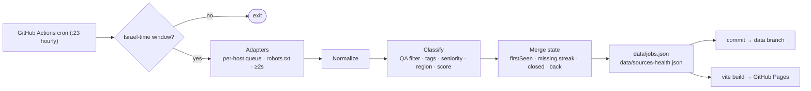

# QA Radar · רדאר משרות QA

[](https://github.com/NoamElharar/qa-radar/actions/workflows/ci.yml)
[](https://github.com/NoamElharar/qa-radar/actions/workflows/collect.yml)

A personal radar for **QA / Test Engineer jobs in Israel**. A polite, scheduled collector gathers openings from ~30 company career pages, ATS feeds and recruitment agencies; a Hebrew, RTL, mobile-first dashboard shows what is **new since yesterday**, how well each job matches my profile, and lets me track applications.

> Built by a QA engineer, so it is tested like one: 150+ unit tests (freshness rules, Hebrew date parsing, real-world false positives, robots.txt handling, DST-aware scheduling), CI on every push, and source-health monitoring that says when a site breaks instead of silently showing fewer jobs.

## Features

- **Freshness first.** Every job carries `firstSeenAt` from our own clock — never the site's (often re-dated) posting date. Badges: **חדש** (< 24h), **טרי** (< 72h), **חזרה** (came back), **נסגרה** (missing for 3 consecutive *successful* runs).
- **Failure-safe state machine.** A source that fails, or suddenly returns far fewer jobs than usual, never closes its jobs. A newly added source's first run is a silent baseline, so it can't flood the "new" feed.
- **Hebrew-aware classification** (all dictionaries in editable YAML): QA relevance with real false-positive vetoes ("בודק/ת ביטחוני", "בדיקות אל הרס", "Quality Controller"…), gender forms (בודק/ת, בודקת, בודקי), Hebrew prefixes (ה/ב/ל), subject tags, seniority from titles and "X שנות ניסיון", region and distance from home.
- **Transparent match score (0–100).** Every card lists matched skills ✓ and missing requirements ✗. No external AI APIs.
- **Dashboard:** "חדש היום" default view, search (gender-slash and niqqud tolerant), filters for region / city / distance / topic / seniority / source type / source / time / minimum score, all **stored in the URL** so views can be bookmarked. Personal statuses (נצפה → שמור → הגשתי → ראיון → הצעה / נדחה), notes, "hide company", JSON backup — all kept **only in the browser**.
- **Link-out panel** for sites that must not be scraped (LinkedIn, Glassdoor, Indeed, boards whose terms forbid it, Cloudflare-protected sites): one-tap "last 24 hours" searches and a "בדקתי" button that remembers when I last checked.
- **Source health page:** last successful run, jobs found, errors, suspicious drops.

## How it works



- **Collector** (`collector/`): Node 22 + TypeScript. One adapter per *platform* (Comeet, WordPress REST, RSS, adamtotal, RedMatch, Next.js page data, a selector-driven HTML adapter, …) behind `fetchJobs(): Promise<RawJob[]>`. All sources live in [`config/sources.yaml`](config/sources.yaml).
- **Dashboard** (`web/`): React + Vite + Tailwind, static, reads the two JSON files.
- **Shared** (`shared/`): types, Hebrew normalization and freshness rules used by both.
- **Schedule:** hourly Sun–Thu 07:00–21:00 Israel time, every 3 hours otherwise. The cron runs hourly in UTC and the collector decides in `Asia/Jerusalem` time, so daylight-saving changes need no edits.
- **Storage:** collected data is committed to a separate **`data` branch** — its git history is a free audit log, while `main` stays clean.

## Sources

29 sources are collected automatically and 14 are link-out only. The full audit — platform, access method, robots/ToS notes and feasibility for every source — is in [`docs/PHASE-0-SOURCE-AUDIT.md`](docs/PHASE-0-SOURCE-AUDIT.md).

### Politeness & ethics

- `robots.txt` is checked for **every host before the first request**, API hosts included, and disallowed URLs are refused.
- Requests to the same host are serialized with **≥ 2 s** between them (or the site's `Crawl-delay`); heavy or low-yield sources run every few hours (`everyHours`).
- Honest User-Agent: `QA-Radar/1.0 (+https://github.com/NoamElharar/qa-radar; personal non-commercial job search)`.
- **No evasion**: sites behind bot challenges, logins or terms that forbid automation are link-out only. No stealth browsers, CAPTCHA solving or proxy rotation.
- Recruiter names/emails that some payloads include are dropped; only a short description excerpt is stored.

## Run it locally

Prerequisites: **Node.js 22+** and git.

```bash
npm install
npm run collect:force   # collect every source now → ./data/*.json  (≈1–2 minutes)
npm run dev             # dashboard at http://localhost:5173
```

Useful commands:

| Command | What it does |
|---|---|
| `npm run collect` | Collect respecting the Israel-time schedule and each source's `everyHours` |
| `npm run collect -- --only sqlink,ness` | Collect specific sources |
| `npm run collect -- --dry-run` | Run without writing data files |
| `npm run try-source -- sqlink --all` | Run one source and print every kept/rejected title with the reason |
| `npm test` | Unit tests (Vitest) |
| `npm run check` | Lint + type-check + tests |

## Adding a company

If it runs on a supported platform, it is one entry in `config/sources.yaml`:

```yaml
- id: acme
  name: Acme
  type: direct            # direct | agency | board
  tier: A
  adapter: comeet
  homepage: https://acme.example/careers
  options: { uid: '12.345', token: ABCDEF0123456789 }
```

Selector-driven HTML pages need no code either:

```yaml
- id: some-agency
  name: Some Agency
  type: agency
  tier: B
  adapter: html
  homepage: https://agency.example/jobs/qa
  categoryQa: true        # the page is already a QA category
  options:
    url: https://agency.example/jobs/qa
    item: '.job-card'
    title: 'h3'
    link: { selector: 'a', attr: href }
    location: '.city'
    description: '.requirements'
```

Then check it with `npm run try-source -- some-agency`. QA keywords, tags and seniority rules live in [`config/taxonomy.yaml`](config/taxonomy.yaml); the city → region map and coordinates in [`config/regions.yaml`](config/regions.yaml); the matching profile in [`config/profile.yaml`](config/profile.yaml).

## Deployment (GitHub Pages)

1. Repository **Settings → Pages → Build and deployment → Source: GitHub Actions**.
2. **Actions → Collect & deploy → Run workflow** once (with *force*). It creates the `data` branch and publishes the site.
3. From then on the schedule runs by itself. Pushing to `main` redeploys the dashboard.

No secrets are needed for Phase 1 (Telegram alerts arrive in Phase 2 and will use `TELEGRAM_BOT_TOKEN` / `TELEGRAM_CHAT_ID` repository secrets).

## Project structure

```
config/        sources.yaml · taxonomy.yaml · regions.yaml · profile.yaml
collector/     src/adapters · src/pipeline (normalize, classify, state, dates) · src/http.ts (polite client) · test/
web/           React dashboard (src/components, src/lib)
shared/        types · Hebrew normalization · freshness rules
docs/          source audit and architecture notes
.github/       CI and the scheduled collect & deploy workflow
```

## Roadmap

- **Phase 2:** cross-source dedup ("פורסם גם ב…"), refined match scoring, Telegram alerts with quiet hours, headless adapter for JS-only pages (Wix), adapter tests on recorded real pages, Playwright E2E tests for the dashboard.
- **Phase 3:** statistics (new jobs per day / source, top hiring companies) and job-alert e-mail ingestion (e.g. Drushim alerts).

## License

Personal, non-commercial project. Job postings belong to their publishers; the dashboard only links back to the original postings.
