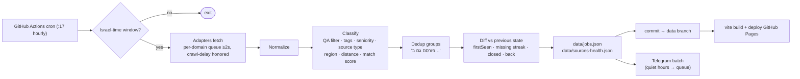

# QA Radar (רדאר משרות QA) — Phase 0: Source Audit & Architecture

> **Corrections made during Phase 1 (2026-10-04).** The audit checked robots.txt of each careers *site* but not of the *API hosts* some of them call. Checking those in Phase 1 changed two rows:
> - **Wix** — `api.smartrecruiters.com/robots.txt` disallows all crawlers (except LinkedInBot), so the SmartRecruiters API is not used. Wix moves to **C** (headless page render, Phase 2) and is link-out until then. Base44 stays **A** via its own `base44.app` endpoint (robots allows).
> - **Proceed** — `services.adamtotal.co.il/robots.txt` is `User-agent: * Disallow: /`, so Proceed moves to **D** (link-out).
> - **GotFriends** — the QA lobby is paginated (`?page=N`) and holds **~240** QA jobs, not 11.
> - **Maccabi Dent** — only role-category pages, no individual jobs → disabled link-out.
>
> The collector now checks robots.txt for **every** host it touches at runtime, so a future mistake like this fails loudly instead of being ignored.

*Audit performed 2026-10-03/04 from this PC (residential connection), with an honest User-Agent, robots.txt checked first, and ≥ 2 s between requests per domain. Every number below was measured during the audit, not estimated from memory. "~" marks rough counts from HTML.*

---

## 1. TL;DR

| | Count | Sources |
|---|---|---|
| **A** — JSON API / RSS / WP REST | **14** | NESS, Proceed, CommIT, Comblack, Aman, Masav, One Zero, Shva, MAX, Wix, Base44, El Al, Clalit, Keshet |
| **B** — static HTML parsing | **18** | GotFriends, SQLink, Compie, Tesnet, Yael, InManage, Moveo, Abra, Gtech, IBI, Mataf, Altshuler, Israel Railways, CBC, Maccabi Dent, IEC, Noga, Reshet 13 |
| **C** — headless browser needed | **0** | — (see "Key findings" #1) |
| **D** — link-out only | **12** | LinkedIn, Glassdoor, Indeed, Drushim, Jobnet, Goozali, Malam Team, Isracard, NTA, Maccabi, Logica-IT, Prologic |
| Not a job source | 1 | Niloosoft |

**Key findings**

1. **No headless browser needed in the collector.** Every JS-rendered career page I inspected turned out to load its jobs from a JSON endpoint the collector can call directly. The only pages that "need" a real browser are sites behind Cloudflare *bot challenges* (Malam Team, Isracard, NTA). Getting past those would mean evading bot detection, which I won't build, so they're link-out (D). Playwright stays in the project only for dashboard E2E tests.
2. **~250 open QA roles right now in collectable (A/B) sources**, before dedup. The biggest: **SQLink ~97**, **Yael Group ~43**, **NESS 36**, **Comblack 23**, **GotFriends 11**.
3. **~10 platform adapters cover all 32 collectable sources**: Comeet ×4, adamtotal (career site ×3, services API ×1, WordPress "adam-jobs" plugin ×2), WordPress REST ×2, SmartRecruiters, RedMatch, RSS, Next.js page data, plus a config-driven generic HTML adapter.
4. **Surprises worth knowing:**
   - **Wix** runs on **SmartRecruiters** (company `Wix2`), which has a public Posting API. That avoids `careers.wix.com/positions?keyword=…`, which Wix's robots.txt disallows. Base44's jobs are in the same feed.
   - **One Zero's** site is behind Cloudflare, but its jobs come from **Comeet's** public careers API, so the collector never touches onezerobank.com.
   - The **"unknown adamtotal org" is CBC Israel** (Central Bottling Co.: Coca-Cola, Tara, Prigat, Neviot). I identified it from the logo banner embedded in the page.
   - **Logica-IT's** site is down: `www.logica-it.com` answers every request with a 308 redirect to itself. Their QA jobs appear on Drushim, so the quick-launch panel links to their Drushim company page.
   - **Prologic's** QA category pages exist but currently list zero jobs (the footer says © 2018).
   - **Niloosoft** is an ATS vendor's homepage, not a job list (as you suspected).
   - **Comblack's** listing page (you asked for it): `https://comblack.co.il/career/`. The collector uses WP REST instead.
5. **ToS:** Drushim's terms (§15) and Jobnet's terms (§27, §23) **explicitly ban automated harvesting**, so both are link-out. LinkedIn's robots.txt says automated access is "strictly prohibited".
6. **`postedAt` really is unreliable.** Aman's and Tesnet's RSS feeds carry 2024–2025 dates for jobs that are still open, and NESS/adamtotal expose "last updated" dates that move. `firstSeenAt` (our own clock) must drive freshness.

---

## 2. Tier legend

- **A**: the source (or the ATS behind it) exposes structured data: a JSON API, RSS, or WordPress REST. Most robust.
- **B**: server-rendered HTML parsed with `cheerio`, using selectors kept in config. Breaks on redesigns, and the health page will catch that.
- **C**: needs Playwright. None today.
- **D**: link-out only (ToS/robots forbid automation, the site sits behind bot protection or login, or there's nothing to parse). These go in the quick-launch panel with "last 24h" links and a "בדקתי" button.

---

## 3. Source audit table

Columns: **JS?** = jobs not in the initial HTML. **QA now / total** = QA-relevant jobs vs. all jobs at the measured endpoint, as of 2026-10-04.

### 3.1 Job boards / aggregators

| # | Source | Platform | Best access method | robots / ToS | JS? | Tier | QA now / total | Notes |
|---|---|---|---|---|---|---|---|---|
| 1 | LinkedIn | LinkedIn | Link-out: your URL (already `f_TPR=r86400`) | robots.txt: automated access "strictly prohibited" | yes + login wall | **D** | many | Quick-launch |
| 2 | Glassdoor | Glassdoor | Link-out: your URL with `fromAge=1` (yours had 14) | ToS prohibits scraping; bot protection | yes | **D** | many | Quick-launch |
| 3 | Indeed | Indeed | Link-out: `il.indeed.com/jobs?q=QA&fromage=1&sort=date` | ToS prohibits scraping; robots disallows `/*?rss` | yes | **D** | many | Quick-launch |
| 4 | Drushim | Next.js + bot-detection script (`stormcaster.js`) | Link-out: `drushim.co.il/jobs/search/QA/` | **Terms §15 bans harvesting with automated software**; robots also restricts `/api/jobs/search?…area=` | SSR | **D** | 194 search results | Biggest board. Logica-IT posts here. |
| 5 | Jobnet | ASP.NET | Link-out (QA search URL to confirm in Phase 1) | **Terms §27 bans automated search/scan/retrieval; §23 bans data collection** | SSR | **D** | — | Quick-launch |
| 6 | GotFriends | Umbraco (placement agency) | HTML: `/jobslobby/qa/` + sub-lobbies (`qa-positions`, `automation-developer`, `qa-team-leader`…) | robots allows (only `/jobssalary` disallowed); no ToS page found | no | **B** | 11 / 11 | Cards include job no., area, requirements. Clients are anonymized ("חברת סטארט-אפ בתחום הסייבר"). |
| 7 | Goozali | ~10 embedded Airtable shared views | Link-out: `goozali.com/#jobopenings` | No public API without the owner's key; Airtable's internal endpoints are undocumented | yes (virtualized grid) | **D** | many (startups) | Quick-launch |

### 3.2 Outsourcing / QA & IT services

| # | Source | Platform | Best access method | robots / ToS | JS? | Tier | QA now / total | Notes |
|---|---|---|---|---|---|---|---|---|
| 8 | NESS | Angular SPA + own JSON API | `GET /careers/api/Careers/GetAllItems` (+ `GetAreas`, `GetProfessions` code tables) | allows | yes | **A** | **36 / 215** | `lastUpdated` in dd/mm/yyyy. The payload includes recruiter names and emails; those are **not stored**. |
| 9 | Proceed | Framer site + **adamtotal services API** | `POST services.adamtotal.co.il/api/Career/GetOrdersDetails?api_key=…`, body `{token}` (both are public in the page's JS) | allows | yes | **A** | 5 / 67 | Richest fields: `orderDate`, `update_date`, advertising start/end, area, profession, **`client_name`** |
| 10 | Prologic | Custom ASP (Cloudflare CDN, no challenge) | Category pages `/בודקי-תוכנה-QA`, `/qa-תוכנה` exist but contain **no job items** | allows | no | **D** (monitor) | 0 | Looks abandoned (© 2018). Link-out, re-check monthly. |
| 11 | Gtech | WordPress | HTML: `/משרות/` (all jobs on one page; category "בדיקות תוכנה") | allows; "Shield" anti-bot plugin present, but plain fetch works | no | **B** | ~3 / ~15 | The URL you gave (homepage) isn't the list; `/משרות/` is. |
| 12 | SQLink | Umbraco | HTML: `/career/db/qa/`, which holds 100 job boxes (`div.boxInput#<jobId>` → `h3.positionTitle`). `?page=` is ignored server-side, so one request gets everything. | allows (except `/archive/`) | no | **B** | **~97 / 100** | Largest QA source. End client is described generically ("לחברה פיננסית"). |
| 13 | Logica-IT | — | **Site down**: 308 redirect loop to itself | — | — | **D** | — | Quick-launch → Drushim company page 311679. Health page flags "unreachable". |
| 14 | Compie | Next.js (pages router) + Strapi CMS | HTML: parse the `__NEXT_DATA__` JSON (id, jobNumber, title, published_at…) | allows | SSG | **B** (structured) | 0 / 15 | Coordinator emails in the payload are **not stored** |
| 15 | CommIT | **Comeet** | Comeet API `company/76.008` | allows; public career token | widget | **A** | 5 / 151 | Many offshore roles (Kyiv…), so the region filter matters |
| 16 | Comblack | WordPress CPT `careers` | WP REST `/wp-json/wp/v2/careers?per_page=100&page=N` (`X-WP-Total` = 314 → 4 pages) | allows all | no | **A** | **23 / 314** | Human listing page: `https://comblack.co.il/career/` |
| 17 | Tesnet | WordPress job archive | HTML `/job/` (all 31 on one page). The RSS `/job/feed/` holds only the latest 10, which isn't enough for closed-detection. | robots disallows root `/feed/` (not `/job/feed/`) | no | **B** | ~1–3 / 31 | QA-specialist outsourcer, but the current list is mostly defense/electronics |
| 18 | Aman Group | WordPress taxonomy | RSS `/careers/בדיקות-תוכנה-qa/feed/` (QA category only; follow `?paged=2` if > 10) | **Crawl-delay 10**, honored | no | **A** | **7 / 7** | RSS dates from 2025 on still-open jobs |
| 19 | Yael Group | WordPress + **"adam-jobs" plugin** (adamtotal backend) | HTML `/jobs/`: all 370 jobs in one 4.5 MB page (`.job_item`, `/jobs/order/<id>/`) | **Crawl-delay 10** | no | **B** | **~43 / 370** | Second-largest QA source |
| 20 | Malam Team | WordPress CPT `משרה` behind a **Cloudflare managed challenge** | Link-out (career lobby) | robots allows, but the CF challenge blocks every non-browser client (wp-json too) | no (behind CF) | **D** | ? (dozens of IT roles) | Collecting would mean evading bot protection. Revisit if they expose RSS or an API. |
| 21 | InManage | Custom (Incapsula in front) | HTML `/דרושים` (~17 jobs, one page) | allows | no | **B** | 1 / ~17 | "בודק איכות ידני - QA" open now. Incapsula may block GitHub's IPs (see risks). |
| 22 | Moveo | Webflow CMS | HTML `/jobs/` list (67 jobs; detail pages at `/jobs/<slug>`) | robots file is empty | no | **B** | ~7 / 67 | Includes "Manual QA Engineer – Financial Core Systems", a strong match for you |
| 23 | Abra | WordPress (custom theme) | First batch is server-rendered at `/career/?category=Automation+%26+QA`; the rest via `POST /wp-admin/admin-ajax.php` (`action=abra_ajax_filter_jobs`, `category`, `offset`), which returns JSON `{html,total,loaded}` | robots file is empty | partly | **B** | ~3 / 89 | The WP REST `job` type is stale (2 old posts), so don't use it. "Electromechanical Quality Controller" is non-software QC and must be excluded. |
| 24 | Niloosoft | — | **Not a job source** (ATS/HR software vendor homepage) | — | — | ✖ | — | Which company did you mean? Its career page probably runs on Niloos "Hunter". |

### 3.3 Banks, finance & payments

| # | Source | Platform | Best access method | robots / ToS | JS? | Tier | QA now / total | Notes |
|---|---|---|---|---|---|---|---|---|
| 25 | One Zero | **Comeet** (site is behind Cloudflare) | Comeet API `company/36.00A`; never touches onezerobank.com | — | widget | **A** | 0 / 12 | |
| 26 | MAX | Angular SPA + own JSON API | `GET /api/lobby/getLobby?lobbyName=jobs&page=N` | robots doesn't cover `/api/lobby`; a bot-detection beacon is on the page, but the API answers plain requests | yes | **A** | 0 / ~4 | Call-center roles today; tech roles appear here sometimes |
| 27 | Isracard | Custom CMS behind Cloudflare | Link-out: `/careershome/divisions/טכנולוגיות/` | CF "Attention Required" block for non-browser clients | no (behind CF) | **D** | 0 / 1 tech | |
| 28 | IBI | WordPress (career pages not exposed in REST) | HTML `/career/` (~55 jobs, "משרה מספר NNNN") | allows | no | **B** | 1 / ~55 | "Manual QA Engineer ל-IBI קפיטל" open now |
| 29 | Mataf (FIBI) | IBM WebSphere Portal | HTML jobs page (descriptions inline) | blocks only Googlebot paths | no | **B** | 0–1 | FIBI group's IT arm |
| 30 | Shva | WordPress + **Comeet** | Comeet API `company/1B.007` (token auto-discovered from `comeet.com/jobs/shva/1B.007`) | wp-json 403 (not needed) | no | **A** | 0 / 4 | |
| 31 | Masav | WordPress CPT `position` | WP REST `/wp-json/wp/v2/position` | robots.txt itself returns 403 (Cloudflare); the page and REST return 200 | no | **A** | 1 / 3 | "בודק תוכנה באוטומציה Python" |
| 32 | Altshuler Shaham | **adamtotal career site** | HTML `career.adamtotal.co.il/Home/Index?token=…&prof=מחשוב ומערכות מידע` (`job-card`, PagedList paging) | no robots.txt (404) | no | **B** | 1 / 1 (IT filter) | "QA Engineer & Production Support – פייננשייל סרביסס". Pages are ~6 MB because of inline base64 banners. |

### 3.4 Tech companies

| # | Source | Platform | Best access method | robots / ToS | JS? | Tier | QA now / total | Notes |
|---|---|---|---|---|---|---|---|---|
| 33 | Wix | **SmartRecruiters** (company `Wix2`) | `GET api.smartrecruiters.com/v1/companies/Wix2/postings` (public Posting API) | careers.wix.com disallows `/positions?*` keyword URLs; the API avoids them | yes | **A** | 0 / 72 | Has `releasedDate`. Wix titles roles "xEngineer"; little classic QA. |
| 34 | Base44 | Base44 app + SmartRecruiters | Covered by the Wix2 feed (roles carry a "- Base44" suffix). Fallback: `GET base44.app/api/apps/68f7942e…/functions/getJobs` | allows | yes | **A** | 0 / 25 | Company set to "Base44" from the title suffix |

### 3.5 Public sector, health, infrastructure & transport

| # | Source | Platform | Best access method | robots / ToS | JS? | Tier | QA now / total | Notes |
|---|---|---|---|---|---|---|---|---|
| 35 | El Al | Umbraco headless | `GET /api/contentPage/path/x00xhebx00xcareerx00xall-jobs` (apply links → `campaign.adamtotal.co.il`) | allows | yes | **A** | 0 / ~30 | **False-positive trap:** "אגף ביטחון - בודק/ת ביטחוני" |
| 36 | Israel Railways | **adamtotal career site** | HTML (125 jobs, `?page=N`) | no robots.txt | no | **B** | 0 / 125 | |
| 37 | **CBC Israel** (the "unknown org") | **adamtotal career site** | HTML (`search=בודק`) | no robots.txt | no | **B** | 0 today | Here "בודק/ת" usually means food QC, so the QA filter must exclude it |
| 38 | NTA | ? behind **Cloudflare Turnstile** | Link-out | Interactive bot challenge | — | **D** | ? | |
| 39 | Clalit | **RedMatch ATS** | `POST jobs.clalitapps.co.il/CandidateAPI/api//position/Search/{affiliateGUID}` with body `{"KeyWords":"","CategoryId":["0"],"countryId":2,"cityId":[]}` | no robots.txt | yes | **A** | 0 / 549 | 1.6 MB response; `activationDate` per job |
| 40 | Maccabi | Umbraco + JSON API | Link-out (`Professions=8` = technology, 17 jobs) | **robots disallows `/api/`**, and the list loads only from `/api/maccabi/SearchJobsApi/FilterJobs`; no jobs sitemap | yes | **D** | ? / 17 tech | |
| 41 | Maccabi Dent | WordPress | HTML `/career/*` category pages | allows | no | **B** | 0 | Dental roles only. Low value, disabled by default. |
| 42 | IEC | WordPress + **"adam-jobs" plugin** | HTML (`data-order_id`, `data-areas`, `data-profs`, application deadline) | allows all; bot-detection script present | no | **B** | 0 / 23 (filtered) | **False-positive traps:** "בודק/ת מתקנים במתח גבוה", "בדיקות אל הרס" |
| 43 | Noga | Umbraco | HTML `/jobs/` (14 × `/jobs/jb-NNN/`) | allows | no | **B** | 0 / 14 | |

### 3.6 Media

| # | Source | Platform | Best access method | robots / ToS | JS? | Tier | QA now / total | Notes |
|---|---|---|---|---|---|---|---|---|
| 44 | Reshet 13 | Next.js (SSR) | HTML: the jobs item page (all jobs inline) | this path is allowed | SSR | **B** | 1 | "בודק/ת תוכנה (QA) לחטיבת הדיגיטל – החלפה לחופשת לידה" |
| 45 | Keshet | **Comeet** | Comeet API `company/26.009` | allows | SSR + widget | **A** | 0 / 22 | Media-domain bonus |

---

## 4. Platform → adapter map

One adapter per platform. Adding a company that already runs on one of these is a single entry in `config/sources.yaml`.

| Adapter | Kind | Sources today | Config per source |
|---|---|---|---|
| `comeet` | A (JSON) | CommIT, Keshet, One Zero, Shva | `uid`, `token` (or auto-discover from the Comeet-hosted page) |
| `smartrecruiters` | A (JSON) | Wix (+ Base44) | `company` |
| `wp-rest` | A (JSON) | Comblack, Masav | `baseUrl`, `postType` |
| `rss` | A (XML) | Aman | `feedUrl` |
| `adamtotal-api` | A (JSON) | Proceed | `token` |
| `redmatch` | A (JSON) | Clalit | `affiliateGuid`, `countryId` |
| `next-data` | B (JSON in HTML) | Compie | `url`, JSON path |
| `adamtotal-site` | B (HTML) | Altshuler, Israel Railways, CBC | `token`, optional `prof`/`search`/`area` |
| `adam-wp-plugin` | B (HTML) | Yael, IEC | `url`, theme variant (selectors) |
| `html` (generic, selector-driven) | B (HTML) | SQLink, GotFriends, Tesnet, Moveo, Abra, Gtech, IBI, Mataf, InManage, Noga, Maccabi Dent, Reshet 13 | `url(s)`, item/title/link/location selectors, optional pagination |
| Small custom adapters | A (JSON) | NESS, MAX, El Al | per-site field mapping |
| `link-out` | D | the 12 D sources | quick-launch URL(s) |

Cheap future adapters, since you'll keep adding companies: `greenhouse`, `lever`, `workable`, and `ashby` all have public, documented job-board APIs. I'll add whichever one your first new company needs.

---

## 5. Final architecture

The default from your spec, with three deviations, each with its reason:

1. **No Playwright in the collector** (it stays in dev dependencies for dashboard E2E tests). No source needs it (see §1). The adapter interface still allows a headless adapter later.
2. **DST-proof scheduling in code, not in cron.** The workflow fires every hour at **:17 UTC** (avoiding the overloaded top of the hour). The first step computes Asia/Jerusalem local time and exits within seconds unless it's (Sun–Thu, 07:00–21:00) or an every-3-hours slot. Israeli DST changes then need no cron edits.
3. **Data is committed to a dedicated `data` branch, not `main`.** You keep the git-history audit log, and `main` stays readable for the portfolio. The workflow checks out `main` (code) plus `data` (state), runs, commits `data`, then builds and deploys Pages with the JSON included (same origin, no CORS, no raw.githubusercontent caching).



**Stack:** Node 22 LTS + TypeScript, `undici` fetch, `cheerio`, `fast-xml-parser`, `zod` for config and data validation, Vitest. Frontend: React + Vite + TypeScript + Tailwind with logical properties only (`ps-*`, `ms-*`, `start-*`), Heebo font, `dir="rtl"` plus `dir="auto"` on mixed titles. npm workspaces: `collector/`, `web/`, `shared/` (types, Hebrew normalization, freshness rules shared by both).

**Freshness & state rules** (the core feature, unit-tested in isolation):
- `id` = `sourceId:sourceJobId`, falling back to `sourceId:sha1(canonicalUrl)`.
- Per job: `firstSeenAt`, `lastSeenAt`, `postedAt?` + `postedAtRaw`, `missingStreak`, `state` (`active | closed | archived`), `reappearedAt?`, `baseline`.
- A source run is "successful" only if it returned without error **and** passed a sanity check (≥ 1 job, or ≥ 30% of its recent median). A suspicious drop to 0 counts as a **failed** run, so it never closes jobs, and it raises a health alert.
- Failed run → its jobs are untouched. Successful run → missing jobs get `missingStreak++`; at 3 → `closed`; closed for > 14 days → moved to `data/archive/YYYY-MM.json`. A closed job that reappears → `active` + badge "חזרה".
- A source's first successful run → all its jobs get `baseline: true`. They're listed but get no "חדש"/"טרי" badge and trigger no Telegram message.
- Badges come from `firstSeenAt` (חדש < 24 h, טרי < 72 h). `postedAt` is shown as secondary info only.

**Politeness:** honest UA `QA-Radar/1.0 (+https://github.com/<you>/qa-radar; personal, non-commercial)`; robots.txt re-checked daily and cached; ≥ 2 s per domain (10 s for Aman and Yael); 20 s timeouts; one retry with backoff; `ETag`/`If-Modified-Since` where supported. No stealth plugins, CAPTCHA solving, or proxy rotation.

**Data hygiene:** only QA-relevant jobs are stored (per-source fetched/kept counts go to health). Descriptions are trimmed to a ~600-char snippet for search and scoring. Recruiter names, emails, and phones from payloads are dropped. Expected `jobs.json` size: a few hundred KB.

**Secrets** (GitHub Actions only): `TELEGRAM_BOT_TOKEN`, `TELEGRAM_CHAT_ID` (Phase 2).

**Repo layout (planned)**
```
config/   sources.yaml · taxonomy.yaml (QA filter + tags, HE/EN) · regions.yaml · cities.yaml (coords) · profile.yaml
collector/src/  adapters/ · pipeline/ (normalize, classify, dedup, diff) · notify/ · run.ts
collector/test/ fixtures/ (saved HTML/JSON per adapter) · *.test.ts
web/src/  components/ · views/ · lib/ (url-state, storage, he-time) · e2e/ (Playwright)
shared/   types.ts · hebrew.ts (normalize gender slashes, niqqud, ה/ב/ל prefixes) · freshness.ts
.github/workflows/  ci.yml (lint, typecheck, tests on push) · collect.yml (cron → collect → commit → deploy)
```

---

## 6. Wireframes (mobile-first, RTL; "start" = right side)

**Global:** top bar (start: "רדאר משרות QA"; end: theme toggle ☾/☀, last-update time "עודכן לפני 12 דק׳"). Bottom nav on mobile: **חדש · הכל · שלי · מקורות**. On desktop the bottom nav becomes a side rail on the start (right) side.

**Screen 1: "חדש היום" (default)**
1. Banner: "🔴 7 משרות חדשות מאז הביקור האחרון" (tap = scroll to the first one; those cards get a highlight stripe on the start edge).
2. Filter chips row (horizontally scrollable): `מרכז + שפלה ✕` · `24 שעות ✕` · `+ סינון`. "+ סינון" opens a bottom sheet with every filter (אזור, עיר, מרחק, נושא, בכירות, סוג מקור, מקור, זמן פרסום, ציון מינימלי, הסתר מטופלות). Sort toggle: חדש ביותר / התאמה הכי טובה. All of this state lives in the URL query string.
3. Search field (Hebrew + English, gender-slash and niqqud tolerant).
4. Job cards, newest first.
5. Collapsible panel "לוחות חיצוניים (בדיקה ידנית)": one row per D source → [פתח 24 שעות אחרונות ↗] and [בדקתי ✓]. Shows "נבדק לפני 5 שעות", and the row turns amber if not checked today.

**Job card**
- Row 1: freshness badge (חדש / טרי / חזרה / נסגרה) · **title** (`dir=auto`, bidi-isolated) · match pill `82` (green ≥ 70, amber 40–69, grey < 40).
- Row 2: company, or "דרך SQLink · לקוח: ארגון פיננסי" for outsourcers.
- Row 3: 📍 city · region chip (מרכז / שפלה) · "18 ק״מ" · "נראתה לראשונה לפני 3 שעות".
- Row 4: tag chips (API/Backend · פינטק/בנקאות · ידני/E2E) + seniority chip.
- Row 5 (tap to expand): ✓ matched skills (Postman, SQL, Kafka…) / ✗ missing requirements (Python, 5+ שנים…).
- Row 6: **[הגש מועמדות ↗]** (primary; opens the original posting in a new tab) · [⭐ שמור] · [⋯] status menu (נצפה / הגשתי / ראיון / הצעה / נדחה / לא רלוונטי / הסתר חברה / הערה).
- Footer (if duplicates exist): "פורסם גם ב: Tesnet · GotFriends" (each a link), so you can pick the channel.

**Screen 2: "הכל"**: the same list and filters with a broader default preset (all regions, last month, open jobs only).

**Screen 3: "המועמדויות שלי"**: grouped by status (הגשתי → ראיון → הצעה; collapsed: נדחה / לא רלוונטי), with date applied and notes. Export/Import JSON buttons and a hidden-companies list (which is where your current employer goes).

**Screen 4: "מקורות"**: a table of sources with a status dot (🟢 ok · 🟡 suspicious drop · 🔴 failing · ⚪ link-out), last successful run, jobs found (QA / total), consecutive failures, and the last error message. Failing sources also show a red banner on screen 1: "2 מקורות לא נטענו — ייתכן שחסרות משרות".

---

## 7. Assumptions (recorded per your instructions; tell me if any is wrong)

1. **Public GitHub repo:** free unlimited Actions minutes, free Pages, and it doubles as your portfolio. Statuses/notes/hidden companies live only in your browser's localStorage, never in the repo. (See decision #3 about your profile.)
2. Only QA-relevant jobs are stored. Non-QA jobs are counted in source health but not kept.
3. Area words without a city map straight to regions: "גוש דן"/"אזור המרכז"/"מרכז" → מרכז; "השפלה" → שפלה; "השרון" → שרון; and so on. Hybrid/remote is a separate flag.
4. Default quiet hours 22:00–07:00 Israel time; Telegram match threshold 60 (both Phase 2, both configurable).
5. Base44 comes from the Wix2 SmartRecruiters feed (no separate adapter).
6. Tesnet uses HTML, because its RSS is capped at 10 items.
7. Glassdoor quick-launch uses `fromAge=1` instead of your link's 14.
8. Maccabi Dent is disabled by default (no IT roles ever seen); kept in config so you can enable it.
9. Node 22 LTS and npm (no pnpm/yarn), to keep setup simple for you.

---

## 8. Risks & unknowns

| Risk | Impact | Mitigation |
|---|---|---|
| **GitHub runners use Azure datacenter IPs.** Sites fronted by Akamai (El Al, Keshet's page), Incapsula (InManage), Cloudflare CDN (Masav, Abra, Prologic) or bot scripts (IEC) may block datacenter IPs even though they all worked from this PC. | Some A/B sources may fail in Actions | The first scheduled run is the real test. Failures appear on the "מקורות" page, and a source that is blocked in CI becomes D. No evasion. |
| HTML layout changes (B sources) | Silent data loss | Sanity check + health alerts; saved fixtures make adapter tests fail loudly when parsing breaks. |
| Comeet or adamtotal tokens rotate | Source returns an error | Auto-discover the Comeet token from the hosted page each day; failures surface in health. |
| `postedAt` unreliable (proven: Aman, Tesnet) | Wrong "new" flags | Badges are based on `firstSeenAt` only. |
| GitHub cron can run 5–20 min late, occasionally skipped under load | Slight lag | Acceptable for hourly; the off-minute (:17) helps. |
| Scheduled workflows auto-disable after 60 days without repo activity | Collector stops | Every run commits to `data` (health timestamps), which counts as activity. |
| adamtotal career pages are 1–6 MB (inline base64 banners) | Slow-ish runs | Use filtered URLs (prof/search) to limit pages; still fine hourly. |

---

## 9. What I need from you before Phase 1

1. **Approve the tiering**, especially the D calls:
   - Drushim/Jobnet: their ToS ban automation.
   - Malam Team, Isracard, NTA: Cloudflare bot challenges, which I won't evade.
   - Maccabi: its jobs API is robots-disallowed.
2. **Tooling on this PC:** Node.js, git, and the GitHub CLI are **not installed** here. Please install **Node.js 22 LTS** and **Git for Windows**, and tell me your **GitHub username** and the repo name you want (suggestion: `qa-radar`). I can't create accounts, and you'll need to sign in to GitHub yourself (`gh auth login` is easiest if you also install the GitHub CLI).
3. **Privacy in a public repo.** Your scoring profile has to be readable by the GitHub Action. My recommendation:
   - Commit only the generic part: skills, domains, target roles, and your home town for the distance filter. That's no more than a CV shows.
   - Keep your **current employer** out of git entirely. "הסתר חברה" lives in localStorage on your phone.

   OK, or would you rather keep the home location in a GitHub secret?
4. **Niloosoft:** which company's careers page did you mean?

Once you approve, Phase 1 = the 32 A/B collectors, `jobs.json`, the dashboard ("חדש היום", filters, cards, statuses, quick-launch for the 12 D sources), CI, and the scheduled deploy. Since no C sources exist, Phase 2's "C sources" slot becomes "re-check D sources + add your new companies", alongside dedup, detailed scoring, Telegram, the health page, and the full test suite.
